  

# Hair Day – Hair Appointment Scheduling Platform

Hair Day is a web-based hair appointment scheduling application developed as part of my JavaScript training program.

This project was built to simulate a real-world booking system, focusing on clean architecture, modular code structure, and modern development practices.

## 🚀 Key Features
- Online appointment scheduling system  
- Dynamic DOM manipulation  
- Real-time date handling  
- Responsive and user-friendly interface  
- Organized booking management  

## 🛠 Technologies & Tools
- JavaScript (ES6+)  
- Node.js  
- DOM API manipulation  
- Day.js (for date management)  
- Webpack (module bundling and optimization)  
- package.json (dependency and project management)  
- HTML5  
- CSS3  

## 🎯 What I Applied in This Project
- Modular JavaScript architecture  
- API integration and data handling  
- Dependency management using Node.js ecosystem  
- Project structuring with Webpack  
- Clean, maintainable, and scalable code practices  

## 📚 Learning Outcome
This project strengthened my understanding of modern JavaScript development, build tools, package management, and real-world application structuring.

